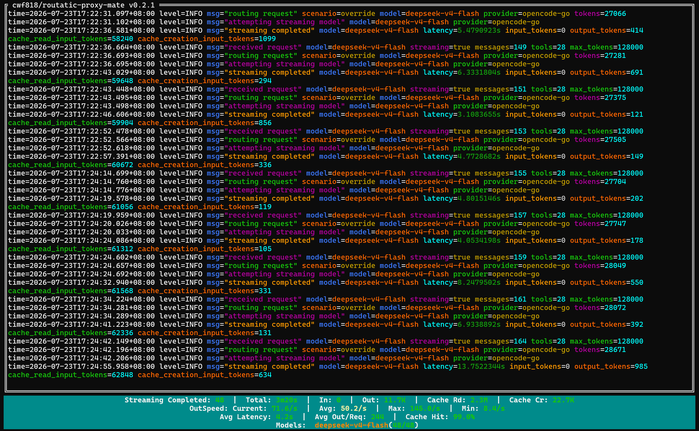

# routatic-proxy-mate

`routatic-proxy-mate` 是一个 CLI 工具，用于读取 `routatic-proxy serve` 的 stdout（通过 stdin 管道 `|`），对每行日志进行着色高亮，并在结束时输出按模型分组的 `streaming completed` 统计汇总。




## 安装

下载预编译 Windows 版本：[最新 Release](https://github.com/cwf818/routatic-proxy-mate/releases/latest)，或通过 Go 安装：

```bash
go install github.com/cwf818/routatic-proxy-mate@latest
```

或手动构建：

```bash
git clone https://github.com/cwf818/routatic-proxy-mate.git
cd routatic-proxy-mate
go build -o routatic-proxy-mate.exe .
```

## 使用方法

管道模式（自动启用 TUI）：

```bash
routatic-proxy serve | routatic-proxy-mate
```

> **PowerShell 用户**：建议使用 `cmd /c` 运行以确保管道正确传递 — `cmd /c "routatic-proxy serve | routatic-proxy-mate"`

传统模式（无 TUI）：

```bash
routatic-proxy-mate --no-tui < examples.log
```

### 命令行选项

| 选项 | 说明 |
|------|------|
| `--no-color` | 禁用 ANSI 颜色输出 |
| `--no-tui` | 强制使用传统管道过滤模式（不启动交互式 TUI） |
| `--row` | 仅对包含此字符串的行着色（可重复） |
| `--key` | 仅对指定的日志键着色（可重复，如 `--key model --key latency`） |
| `--version` | 显示版本号 |

## TUI 模式

当 stdout 为终端时，自动进入交互式 TUI 模式（基于 `tview`）：

- **日志区域**：可滚动的着色日志视图
- **统计栏**：固定在底部的动态统计摘要，当日志超出可视区域且用户向下滚动时自动显示
- **自动滚动**：默认跟随新内容，向上滚动后暂停，滚动到底部恢复跟踪
- **键盘操作**：`↑`/`↓`/`PgUp`/`PgDn` 滚动，`Ctrl+C` 退出
- **退出时**：在 TUI 关闭后，将完整统计汇总表输出到 stdout

## 日志解析

支持 23 种消息类型，包括请求接收、路由、流式调用、回退、错误等。解析器能处理无空格拼接的 `key=value` 场景，例如：

```
latency=3.189401sinput_tokens=0
cache_read_input_tokens=143360cache_creation_input_tokens=578
```

## 统计汇总

所有 `streaming completed` 条目按模型聚合，输出表格包含以下列：

| 列名 | 说明 |
|------|------|
| `Model` | 模型名称 |
| `OK/Att` | 成功请求数 / 总流式尝试数 |
| `Total` | 总延迟 |
| `Avg` | 平均延迟 |
| `OutTok` | 输出 Token 总数 |
| `CacheRd` | 缓存读取 Token 总数 |
| `CacheCr` | 缓存创建 Token 总数 |
| `CacheHit` | 缓存命中率 (CacheRd / (CacheRd + CacheCr)) |
| `SpdAvg` | 平均输出速度 (tokens/s) |
| `SpdMax` | 最大输出速度 (tokens/s) |
| `SpdMin` | 最小输出速度 (tokens/s) |

TUI 统计栏还额外显示：总输入 Token 数、实时当前输出速度以及非 INFO 级别的日志计数。

## 许可

[MIT](LICENSE)

---

[English Documentation](README.md)
